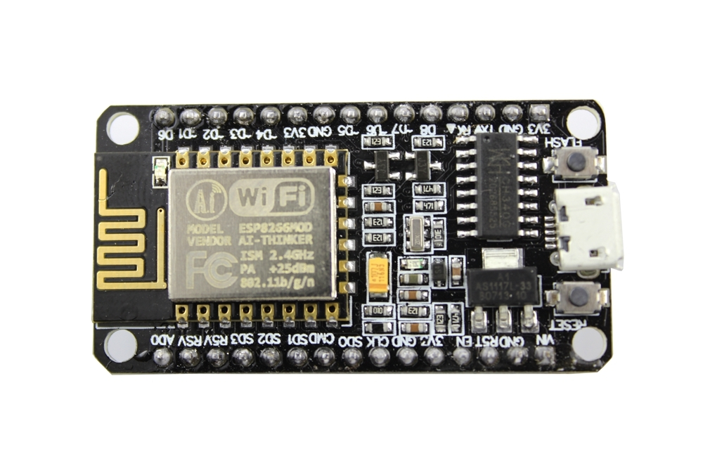
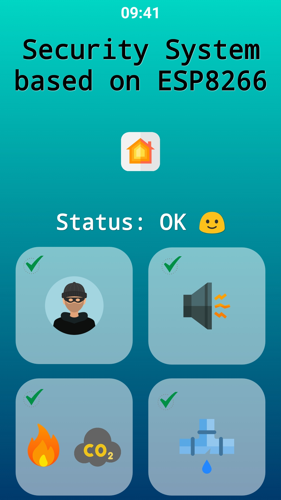
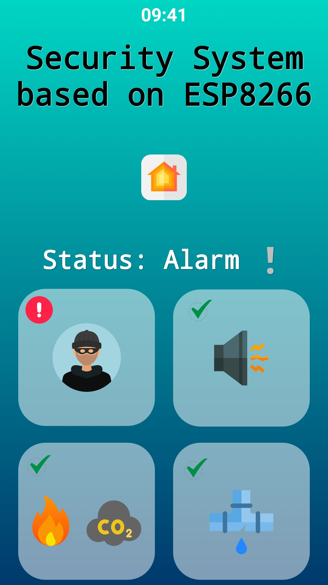
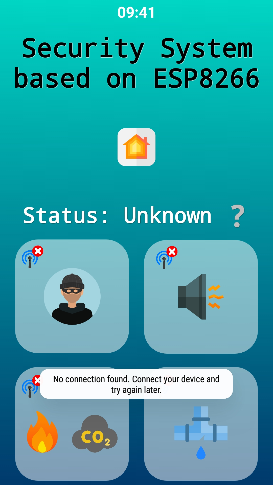

<h2>📱 Security System based on ESP8266</h2>

 

This ESP8266-based security system was developed as a bachelor’s thesis project at Wrocław University of Science and Technology and received a grade of 5 (A, Excellent). It provides real-time alerts for potential safety hazards, including:

<ul> 

  <li> Fire detection alerts</li> 
  <li> CO2 detection alerts</li> 
  <li> Water leak detection alerts</li> 
  <li> Motion detection alerts</li> 
  <li> Noise detection alerts</li> 
  
</ul> 

<h3>🌐 API (Flask)</h3> 

The system communicates through an API built with Flask, hosted on Heroku. This API enables secure and efficient data exchange between the ESP8266 and the user interface.
 

<h3>🛠 Sensors Used</h3> 

The security system utilizes the following sensors:
 

<ul> 
  
  <li>PIR Motion Sensor HC-SR505 with a 100° field of view and detection range up to 3 meters</li> 
  <li>Analog Liquid Level Sensor SE045</li> <li>Air Quality Sensor MQ-135 for detecting pollutants like benzene, ammonia (NH3), and carbon dioxide (CO2)</li> 
  <li>Sound Sensor with a built-in capacitive microphone</li> 
  <li>MC-38 Magnetic Door/Window Contact Sensor</li> </ul> 
  
  <h3>📸 Screenshots</h3> 
  
  
     
     
  

